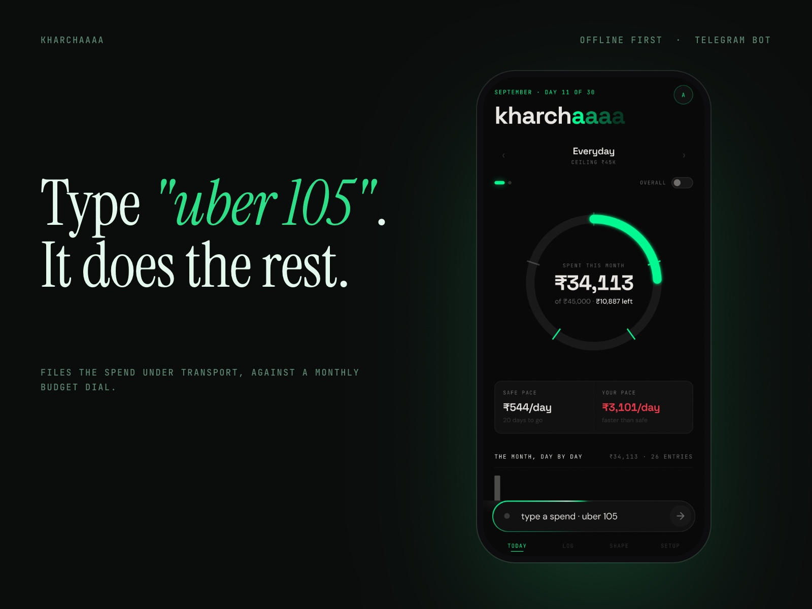
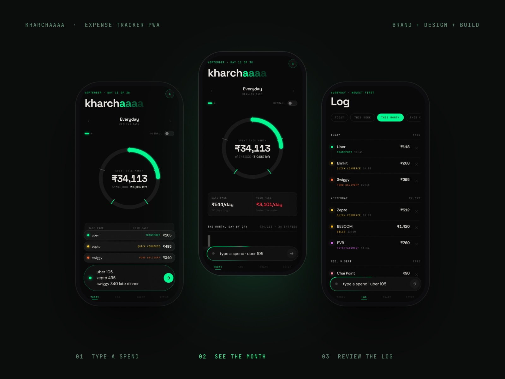
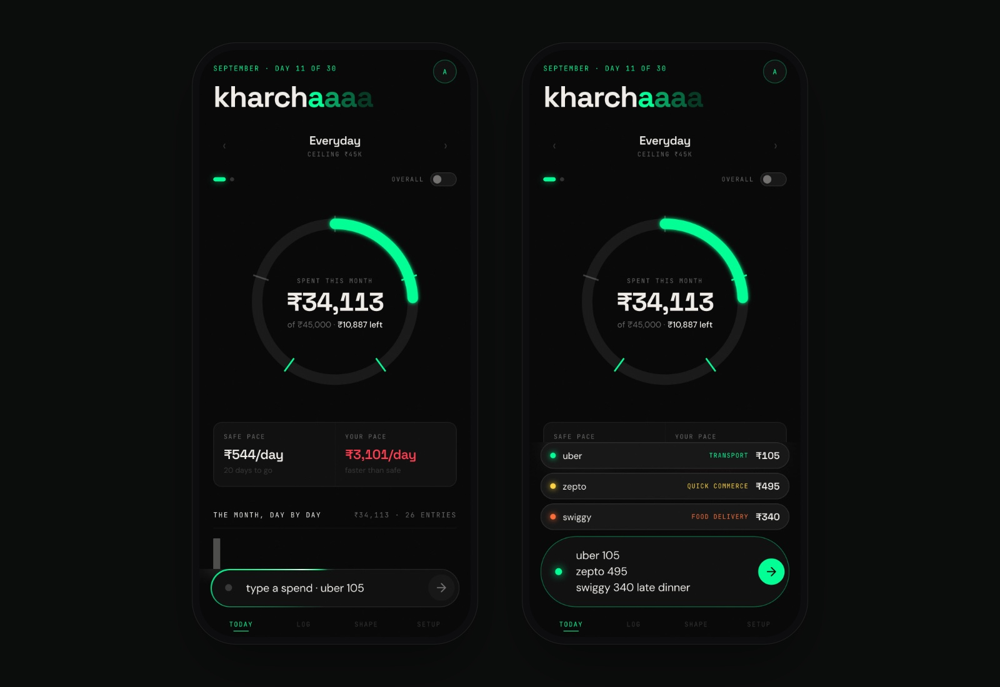
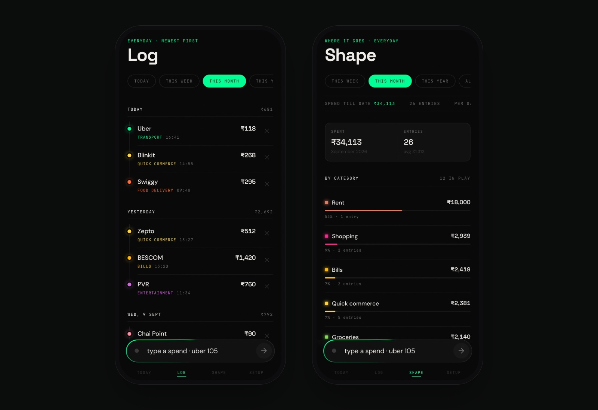
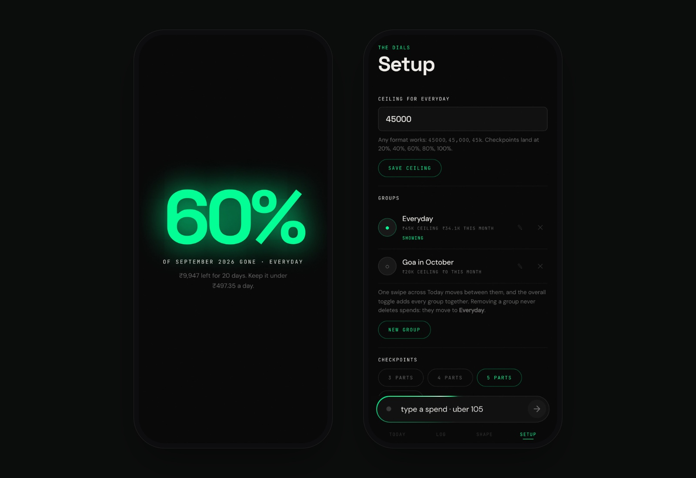

# Kharchaaaa

**An offline first expense tracker PWA with a companion Telegram bot. Brand, product design and build, 2026.**

An expense tracker where the whole interface is a line of text. You type uber 105, and it works out that Uber is transport, files it, counts it against the month, and tells you what that leaves.

## Why Another One of These

Every expense app I tried wanted the same thing from me: a category picked from a dropdown, an amount typed into a numeric field, a date confirmed. Four taps to record a ninety rupee chai. The friction is small and it is fatal, because the entry you do not make is the one that breaks the month.

So the target was one gesture. Open it, type what happened, done. Everything else in the product exists to make that line of text enough.

Left: The Today screen: a ring showing 34,113 rupees spent of a 45,000 rupee ceiling, with checkpoint ticks, and safe pace against actual pace underneath. Right: Three lines typed into the composer, each resolved to a category before being committed: uber to Transport, zepto to Quick commerce, swiggy to Food delivery.

## The Line of Text Does a Lot

Text before the number is the merchant, text after it is a note, and either order works. Amounts arrive in whatever shape a person actually writes them: 105, ₹495, Rs 2,499.50, 1,05,000, 2k, 1.5L, 499/-. One spend per line, so three lines commit three spends.

A preview chip appears for every line before anything is committed, which is the part that matters. You always see what it worked out before you agree to it, so the guessing never happens behind your back.

It also learns. Picking a category for a merchant writes that pairing down, so the same shop files itself forever after. And when it cannot place something it still saves the amount and flags the entry as pending rather than dropping it, because a spend you have lost is worse than one that is filed wrong.

## The Composer Is a Textarea, and That Was a Bug First

It shipped as an input. An input silently strips newlines, so three typed lines merged into one entry and two spends vanished. One spend per line is the entire premise, and the element I had chosen made it impossible.

It is a textarea now, Enter sends and Shift+Enter starts another line. The interesting part is not the fix, it is that the reset had covered button and input but not textarea, so the new element took the browser default and typed black on black until that was found too.

## Two Front Ends, One Idea

There is a phone app you add to your home screen, and there is a Telegram bot. The bot does the same job in chat, and it can read a bank SMS or a photographed bill. They exist because the moment you spend money and the moment you are willing to open an app are rarely the same moment.

They are not connected yet. That is the honest state of it. What they do share is a data model held identical on both sides so they can be joined later without anybody migrating anything:

Amounts are integer paise on both sides, never floats and never rupees, so ₹105 is 10500 and there is no floating point drift anywhere in either half

The twenty category slugs are character for character identical between the bot’s Python and the app’s JavaScript, and changing one means changing both in the same commit

The parser is ported line for line: same regex shapes, same suffix multipliers, same merchant-then-amount rules, same backdating

Checkpoint maths is the same formula on both sides, so a month looks the same whichever half you recorded it in

Joining them later should mean putting one shared store behind both, not rewriting either side. Every change gets measured against whether it keeps that true.

## The Line the Design Rests On

Who you are is on the server. What you spend is not.

The account list is the only thing that ever leaves a phone, and it holds an email, a role and a password hash. Spends stay in that browser’s own storage and no code path uploads one. This is what makes it possible to hand somebody a login without taking custody of what they buy, and it is the constraint I would refuse to trade away for a sync feature.

It costs something real, and the cost is not hidden in the product either: a book does not follow you to a new phone. An account does. Somebody switching devices starts empty and should export a backup first. Moving that data to a server would be a deliberate decision about custody, not a bug to patch quietly.

The passkey is described the same way. It does not prove who you are to anything, it re-opens a session this device already has, which is Face ID instead of retyping. Verifying WebAuthn properly means a server holding public keys and checking signatures, which is more than this app has earned, so the copy says exactly what the button does rather than borrowing the word credential.

Left: The Log, grouped by day, one row per spend with its category and the time it was recorded. Right: The Shape screen breaking the month down by category, rent taking 53 per cent of it.

## It Reports, It Does Not Cheer

The voice is plain and lowercase. Over by ₹2,784. you are overspending. Never a cheerful apology with an emoji, and never a streak, because nobody wants to be congratulated for spending less than they did last week.

Colour follows the same rule. The accent is a signal, not decoration: if everything is green then nothing is. The ring turns amber at eighty per cent and red past a hundred, and those are the only two moments the interface raises its voice.

The one place it is deliberately theatrical is switching between groups, which is a channel change and reads like one: a stepped jolt, the numbers splitting red and cyan, a bright band over scanlines. It stands down completely under prefers-reduced-motion.

## What It Costs to Run

Nothing, and that was a constraint rather than an outcome. The app has no framework, no bundler and no dependencies, which is why it deploys by copying a folder. The bot is Python standard library only, against SQLite. There is one server-side function in the whole product and it answers a single question, which is who is allowed to sign in.

## Where It Stands

The app is live and is what I record my own spending in. It installs to an iPhone home screen, opens full screen, and works with no signal, because signing in needs the network once and nothing after that does.

What is not done is worth saying plainly. The bot is written and tested but not deployed, so it runs on a laptop and stops when the lid closes. Bill reading is built against three interchangeable backends and is inert until one of them has a key. And the two halves still do not share a store, which is the next real piece of work rather than a detail.

The figures in these screenshots are invented. They are one plausible month for one person, not anybody’s actual spending, which is the only kind of screenshot a product like this should ever be shown with.

Left: A checkpoint firing full screen: 60 per cent of September gone, with what is left and the daily rate that would keep it. Right: Setup, showing the ceiling for the active group, a second group for a trip, and the checkpoint count.

*Setup, showing the ceiling for the active group, a second group for a trip, and the checkpoint count*

---

Designed by **Anurag Adhikari** · Anurag Studio · [anurag.studio](https://anurag.studio/work/kharchaaaa) · hello@anurag.studio
